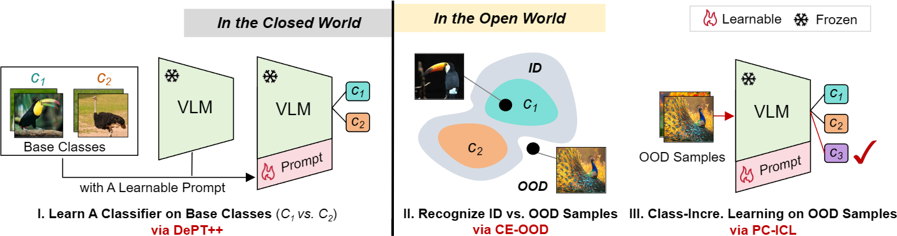
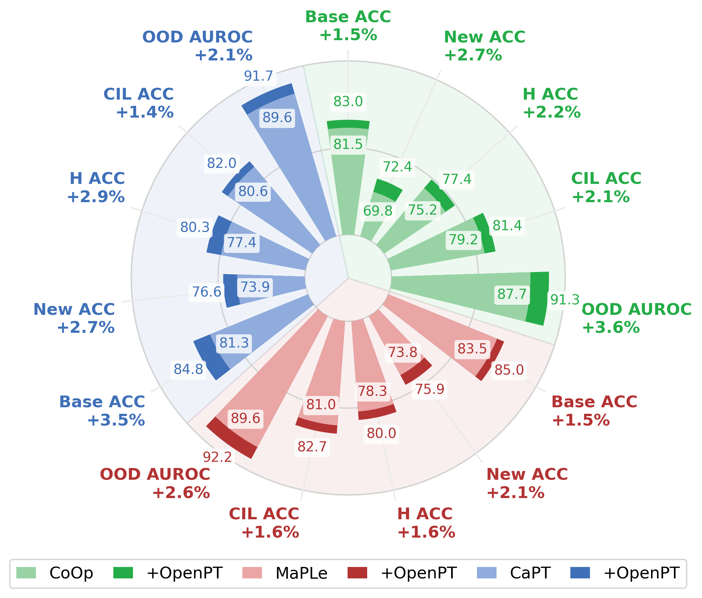
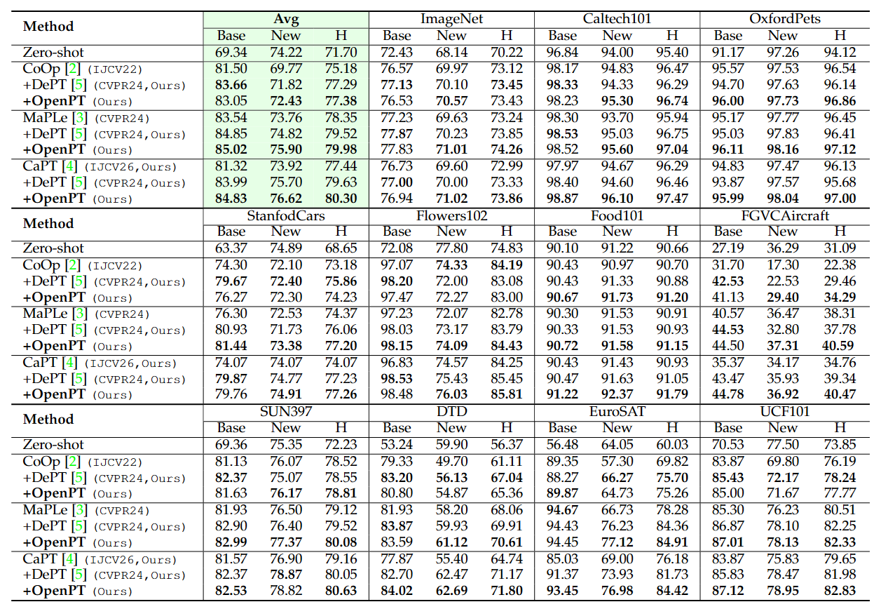
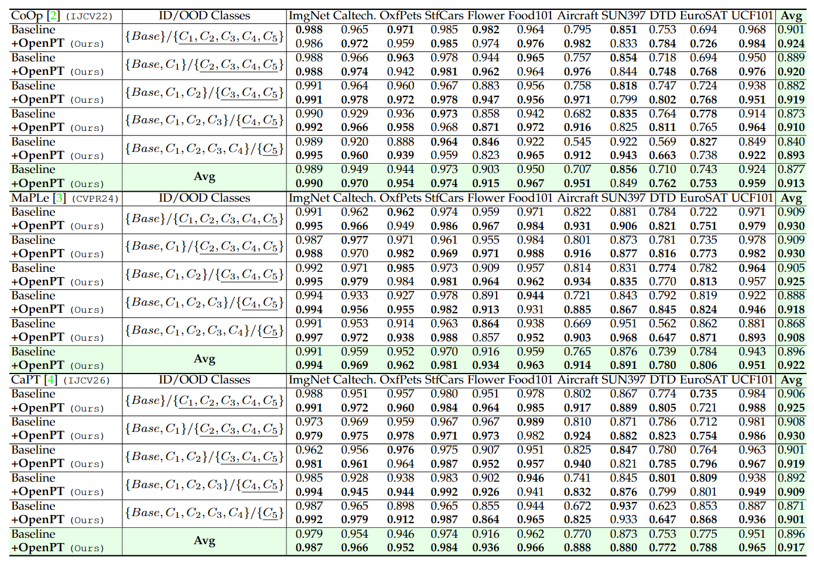
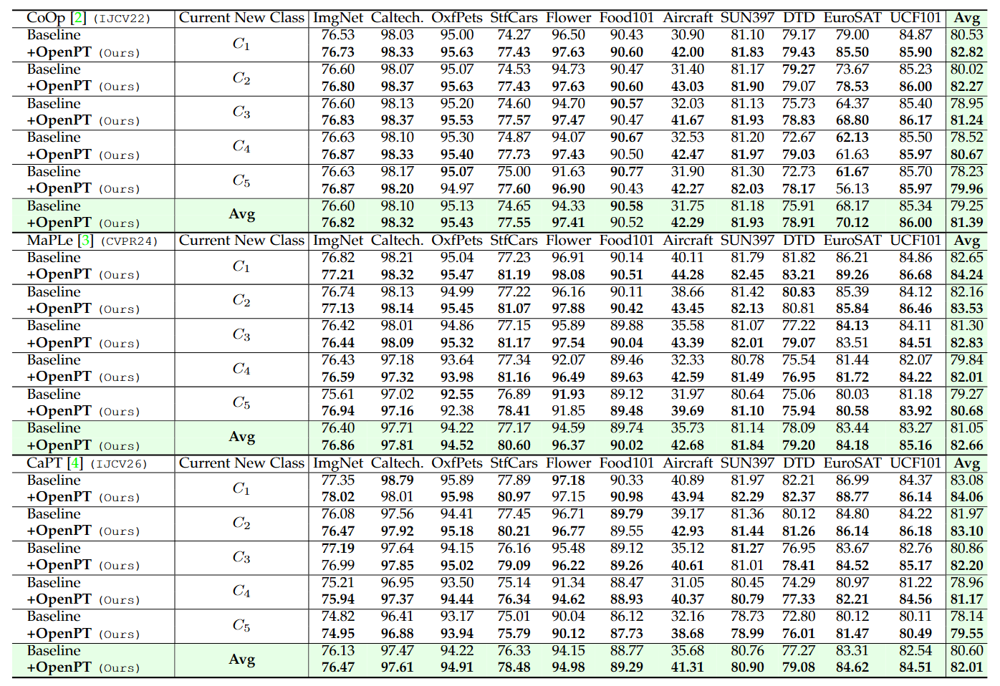

# OpenPT: Towards Open-World Prompt Tuning

This work is an extension of our preliminary conference version, [DePT](https://github.com/Koorye/DePT). 

Our OpenPT can be used as a plugin to improve existingPT methods. Extensive results on a broad spectrum of baselines, datasets, and evaluation metrics demonstrate the effectiveness and flexibility of OpenPT.

Offical implementation of the paper Towards Open-World Prompt Tuning.

**Note:** We are doing our best to improve this work. If you have any questions or suggestions, please feel free to create an issue in this repo or contact us at jizhang.jim@gmail.com.

---

# News

- (xx. xx, 2026)

  - Our paper is accepted at XX
- (May. xx, 2026)

  - Training and evaluation codes for OpenPT are released.
- (May. xx, 2026)

  - Our paper is published on arXiv.

---

# Highlights

> Abstract—Prompt Tuning (PT) has emerged as a promising parameter-efficient paradigm for adapting pre-trained vision-language
> models (VLMs) to downstream tasks. However, largely built on closed-world assumptions, existing approaches simultaneously suffer
> from the Base-New Tradeoff (BNT), OOD Overconfidence, and Knowledge Evolution Deficiency, severely compromising their
> generalizability and reliability in dynamic, open-world environments. In this work, we present Open-World Prompt Tuning (OpenPT), a
> novel framework for achieving generalizable and reliable adaptation of VLMs in the open world. Specifically, we first reveal that the BNT
> problem stems from a channel bias issue, and present Decoupled Prompt Tuning with Simplex Equiangular Tight Frame (DePT++),
> which improves base-to-new generalization by decoupling base-specific and task-shared knowledge into two isolated feature spaces.
> Building upon DePT++, we then introduce Collaborative Energy-based OOD Detection (CE-OOD), which achieves precise OOD
> detection by integrating complementary energy scores from the two decoupled spaces. Finally, we develop Pseudo-Class Guided
> Class-Incremental Learning (PC-CIL) to facilitate the continual learning of new class knowledge by assigning pseudo-class names to
> OOD samples and distancing new class prototypes from old ones. Remarkably, OpenPT can be used as a plugin to improve existing
> PT methods. Extensive results on a broad spectrum of baselines, datasets, and evaluation metrics demonstrate the effectiveness and
> flexibility of OpenPT. 



---

# Main Contributions

> 1. We reveal that the Base-New Tradeoff (BNT) problem in prompt tuning stems from a channel biasissue and propose DePT++ to overcome it from a
>    feature decoupling perspective.
> 2. Based on DePT++, we present OpenPT, a novel and plug-and-play framework for achieving generalizable and reliable VLM adaptation in the open world.
> 3. We demonstrate OpenPT's effectiveness and flexibility using a broad spectrum of baselines, datasets, and evaluation metrics.

# Flexibility and Effectiveness

Our OpenPT is orthogonal to both prompt tuning and adapter tuning approaches, therefore can be used as a plugin to improve all of them.

<div align="center">
  
</div>

**Base-to-new generalization performance over 11 datasets.**



**OOD detection performance after each class-incremental learning session on OpenPT-Bench (AUROC)**




**Class-incremental learning performance on the five new classes from OpenPT-Bench (ACC)**



---

# Installation

This codebase is tested on Ubuntu 20.04.2 LTS with python 3.8. Follow the below steps to create environment and install dependencies.

Setup conda environment (recommended).

**Create a conda environment**

```
conda create -y -n openpt python=3.8
conda activate openpt
```

**Install torch (requires version >= 1.8.1) and torchvision**

```
pip install torch==1.9.0+cu111 torchvision==0.10.0+cu111 torchaudio==0.9.0 -f https://download.pytorch.org/whl/torch_stable.html
```

**Install dassl**

```
git clone https://github.com/KaiyangZhou/Dassl.pytorch.git
cd Dassl.pytorch/
pip install -r requirements.txt
python setup.py develop
```

**Install OpenPT**

```
cd ..

git clone https://github.com/heyhey24/OpenPT.git
cd OpenPT/

pip install -r requirements.txt
pip install setuptools==59.5.0
```

---

# Data preparation

Please follow the instructions at [DATASETS.md](datasets/DATASETS.md) to prepare all datasets. In addition to preparing the data as required, you also need to copy the `openset_ood_class.json` file for each dataset from the `ood class` folder in the code repository to the corresponding dataset folder, for example, Caltech101:

```
caltech-101/
|–– 101_ObjectCategories/
|–– split_zhou_Caltech101.json
|–– openset_ood_class.json
```


---

# Training and Evaluation

We provide parallel running script `parallel_runner.py` for each prompting variant including CoOp (w/ DePT), CoCoOp (w/ DePT), KgCoOp (w/ DePT), MaPLe (w/ DePT). Make sure to configure the dataset paths in environment variable DATA and run the commands from the main directory.

**Base to New Generalization**

```
# Running CoOp (w/ DePT/DePT++)
python parallel_runner.py --cfg coop
python parallel_runner.py --cfg coop_dept
python parallel_runner.py --cfg coop_dept_etf 

# Running CoCoOp (w/ DePT)
python parallel_runner.py --cfg cocoop
python parallel_runner.py --cfg cocoop_dept

# Running KgCoOp (w/ DePT)
python parallel_runner.py --cfg kgcoop
python parallel_runner.py --cfg kgcoop_dept

# Running MaPLe (w/ DePT)
python parallel_runner.py --cfg maple
python parallel_runner.py --cfg maple_dept
```

**Openset experiments**

```
# First train CoOp to obtain CoOp models for each dataset as baseline
python parallel_runner.py --cfg coop  

# Then run this command to test the baseline on multiple metrics: acc, auroc, fpr95, zsclip acc
python parallel_runner.py --cfg baselines_coop   

# Run this command to obtain the base model of the DePT++ model using ETF classifier for subsequent incremental training
python parallel_runner.py --cfg coop_dept_etf  

# Then run this command to perform incremental training and test on multiple metrics: acc, auroc, fpr95, zsclip acc
python parallel_runner.py --cfg openset_coop_dept  
```


After running, the output will be in the `outputs/` directory, the results will be tallied in the `results/` directory as csv, and a mail will be sent to email address.

If you want to add your own models, you'll need to write your models in the `trainers/` directory and register them in dassl, then configure the settings in the `configs/` directory and `train.py` file, and add your new tasks to the `configs.py` file. Then you can run `python parallel_runner.py --cfg your_model` to run our own model.

To perform openset experiments on other baseline models (xxx) later, first create the corresponding trainer file in the `trainers/` folder and name it `xxx_dept_etf.py`. Then create the corresponding configuration file in the `configs/` folder and name it `xxx_dept_etf.yaml`. Finally, add the new task configuration `xxx_dept_etf` in the `configs.py` file.

Next, create the corresponding trainer file in the `trainers/` folder and name it `openset_xxx_dept.py`. Then create the corresponding configuration file in the `configs/` folder and name it `openset_xxx_dept.yaml`. Finally, add the new task configuration `openset_xxx_dept` in the `configs.py` file.

Also, add `baselines_xxx` in `configs.py` to test the baseline.

# Citation

If you use our work, please consider citing

```
@
```

---

# Acknowledgements

Our code is based on [DePT](https://github.com/Koorye/DePT) and [CaPT ](https://github.com/Koorye/CaPT)repositories. If you use our model and code, please consider citing these works as well.
